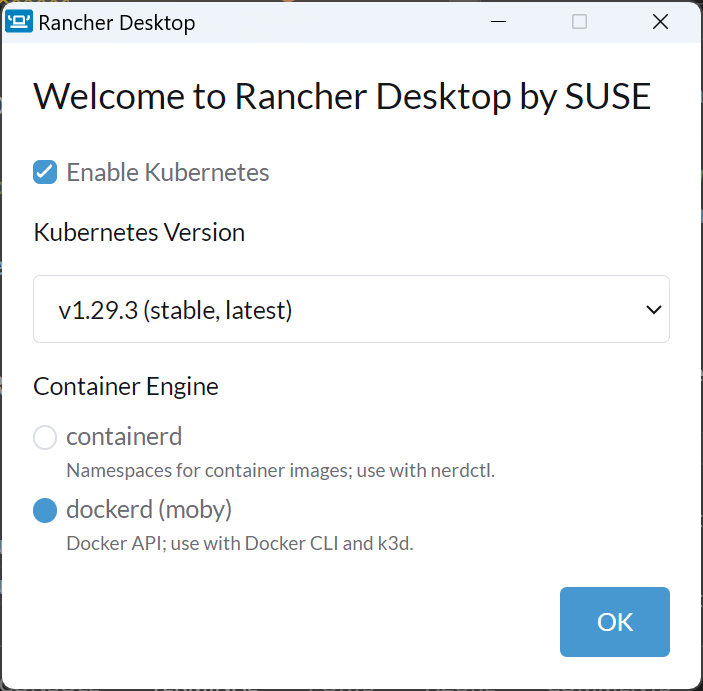

# DevContainer prereqisites

## Configure Git author identity

VS Code Dev Containers copies the host `~/.gitconfig` into the container on startup when that setting is enabled. Ensure the host Git identity is configured before rebuilding the container:

```pwsh
git config --global user.name "Your Name"
git config --global user.email "you@example.com"
```

The `Dev > Containers: Copy Git Config` setting must be enabled in the host-side VS Code `User` settings. Enabling it only in `Remote [Dev Container: ...]` settings is too late, because the copy happens while the container is being created.

If your environment does not copy `~/.gitconfig`, define `CdfUserName` and `CdfUserEmail` on the host before opening the devcontainer. The container startup script uses these values as a fallback when `user.name` or `user.email` is missing.

## Install Rancher Desktop

```pwsh
winget install suse.RancherDesktop
```

## Configure Rancher Desktop


